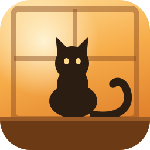

# Windowsill

**Your cats live on your desktop.** They walk along the top of your taskbar, sit, wash, doze off, occasionally chase your cursor, and fall between monitors. You can pick one up and throw it.

It stays out of your way: the overlay ignores your mouse entirely except when the pointer is actually over a cat, so it never intercepts a click meant for real work.

The name is the idea — a cat on a sunlit windowsill, and your taskbar is the ledge.

---

## Install

Download **`Windowsill-setup.exe`** from the [latest release](../../releases/latest) and run it.

Windows will show *"Windows protected your PC"* the first time. The installer is not code-signed — that needs a paid certificate, which is hard to justify for a free cat toy. Click **More info → Run anyway**.

A window opens the first time explaining how it works, and a cat icon appears in your system tray. Everything lives in that tray menu: pause, reload, start-with-Windows, quit.

> **Windows 11 hides new tray icons.** If you can't see the cat, click the **^** arrow next to the clock, then drag it down onto the taskbar to keep it there. You can reopen the instructions any time with **How to add your cats…** in that menu.

It starts with a small drawn cat so there's something to look at. Replacing it with your own is the point.

---

## Add your cats

No terminal, no editing files. Three steps.

### 1. Cut your cat out of a photo

Your cat needs a transparent background, or it appears inside a rectangle. Windows does this for free:

- **Paint** — open the photo → **Remove background** → **Save as → PNG**
- **Photos** — **Edit → Background → Remove**

Pick photos where the whole cat is visible and not overlapping anything. Side-on shots work best for walking.

### 2. Name the files after what your cat is doing

Right-click the tray icon → **Open cats folder…**

Make a folder named after your cat, and put the PNGs in it:

```
Mochi/
    sit.png
    walk-left.png
    sleep-right.png
```

**The filename is the instruction.** The first part is the pose. The `-left` or `-right` says which way your cat is pointing **in that photo** — without it the app assumes right, and a left-facing cat will appear to walk backwards.

#### Every name the app recognises

These are worth having. Start with `sit`, add the others when you feel like it:

| Name | The cat is… | If you don't have it |
| --- | --- | --- |
| `sit` | sitting upright — the pose it rests in most | `idle`, then `stand` |
| `walk` | wandering, seen from the side | `stand`, `idle`, `sit` |
| `sleep` | curled up asleep | `lie`, `sit`, `idle` |
| `run` | sprinting, and skidding after a hard throw | `walk`, `stand`, `idle` |
| `groom` | washing itself | `sit`, `idle` |
| `idle` | standing about between things | `stand`, `sit` |

These are used if present, and quietly substituted for if not. Nobody needs all of them:

| Name | The cat is… | If you don't have it |
| --- | --- | --- |
| `chase` | going after your cursor | `run`, `walk`, `stand`, `idle` |
| `stand` | on all fours, not moving | `idle`, `sit` |
| `lie` | lying down but awake | `sit`, `idle` |
| `fall` | in mid-air, dropped or thrown | `surprised`, `run`, `stand` |
| `held` | being picked up and dragged | `surprised`, `fall`, `stand` |
| `surprised` | startled — used when poked or falling | `fall`, `stand`, `idle` |

**The fallbacks are why one photo works.** A folder containing only `sit.png` gives you a complete cat: every behaviour falls through to it eventually.

#### Facing

Add `-left`, `-right` or `-front` to any name above — `walk-left.png`, `sleep-right.png`, `sit-front.png`:

| Suffix | Use it when |
| --- | --- |
| `-left` | the cat points left in that photo |
| `-right` | the cat points right (this is the default if you leave it off) |
| `-front` | the photo is head-on, so there's no direction to flip. Stops markings swapping sides when the cat turns around. |

#### File formats

**PNG** is what you want. **WebP** and **GIF** also work. A **JPEG will not** — it cannot store transparency, so your cat appears inside a rectangle.

### 3. Reload

Right-click the tray icon → **Reload cats**. Your cat appears.

That's it. Sizes are worked out automatically — the app measures your cat in each photo and scales the poses so a curled sleeping cat doesn't come out as tall as a sitting one.

---

## Tuning

Only if you want to. Add a `cat.json` next to the photos:

```json
{
  "name": "Mochi",
  "height": 170,
  "speed": 1,
  "count": 1
}
```

| Setting | Does what |
| --- | --- |
| `height` | How tall the cat is on screen, in pixels (40–500). **The one worth adjusting.** |
| `speed` | Walking and running speed. `0.5` is an amble, `2` is a menace. |
| `count` | How many of this cat wander about at once (1–12). |

It measures the cat itself rather than the image, so transparent space around your cutout doesn't matter and you never need to crop precisely.

<details>
<summary>Overriding the automatic sizing and facing</summary>

The app guesses both from the photos. If a guess is wrong:

```json
{
  "name": "Mochi",
  "height": 170,
  "poseScale": { "sleep": 0.35 },
  "poseFaces": { "walk": "left" }
}
```

`poseScale` multiplies `height` for one pose. `poseFaces` overrides the direction and wins over the filename suffix.

The automatic sizing holds the cat's on-screen **area** roughly constant between poses — something twice as wide renders about 1/√2 as tall. On a real three-pose photo set that lands within a few percent of values tuned by hand, which is why it is the default rather than something you must configure.

</details>

### A cat looks wrong?

| Looks like | Fix |
| --- | --- |
| Walking backwards | Add `-left` to the filename (or `-right`) |
| Inside a white or grey box | The background wasn't removed — redo step 1 |
| Enormous when asleep | Add `"poseScale": { "sleep": 0.4 }` |
| Sliding rather than walking | Your walk photo is at an angle. A side-on photo reads better |
| Markings swap sides when it turns | Rename to `-front`, or add `"poseFaces": { "sit": "front" }` |

---

## Building from source

```bash
npm install
npm start          # run it
npm run dev        # run it with DevTools
npm run icons      # regenerate .ico files after editing the SVGs
npm run dist       # -> dist/Windowsill-<version>-setup.exe
npm run dist:mine  # same, but with your cats/ folder baked in
```

`npm run dist` deliberately ships **without** any cats — that build is what other people download, and it should start with the drawn sample rather than photographs of someone else's pet. `npm run dist:mine` is for your own machines, where having your cats pre-installed is the point.

There is also a command-line importer, which trims, downscales and writes the config for you:

```bash
npm run prepare-cat -- --cat Mochi --pose walk --faces left "C:/photos/mochi-walking.png"
```

### Where the cats live

| | Path |
| --- | --- |
| Installed | `%APPDATA%\Windowsill\cats` |
| Running from source | `cats/` in the repo |

Installed, the app's own folder is a read-only archive, so cats live somewhere you can actually edit. **Open cats folder…** always opens the right one.

---

## How it works

| File | Role |
| --- | --- |
| [src/main/main.js](src/main/main.js) | App lifecycle, the overlay window, IPC, tray |
| [src/main/desktop.js](src/main/desktop.js) | Virtual-desktop geometry across all monitors |
| [src/main/protocol.js](src/main/protocol.js) | `cats://` scheme serving both the UI and the cat images |
| [src/main/cats-library.js](src/main/cats-library.js) | Reads the cats folder into cat definitions |
| [src/main/welcome-window.js](src/main/welcome-window.js) | First-run window: what this is, where the tray is, how to quit |
| [src/renderer/sprites.js](src/renderer/sprites.js) | Decodes poses, builds alpha hit-masks, derives scales |
| [src/renderer/behavior.js](src/renderer/behavior.js) | The state machine and its transition weights |
| [src/renderer/cat.js](src/renderer/cat.js) | Physics, procedural animation, rendering |
| [src/renderer/world.js](src/renderer/world.js) | Where the floor is at any point |

The overlay is a single transparent, always-on-top, click-through window spanning every monitor, with the cats as elements inside it. Four decisions carry most of the weight:

**Click-through is toggled per pixel.** The window forwards mouse movement while ignoring clicks, so the renderer can watch the cursor without intercepting anything. The moment it lands on a non-transparent pixel of a cat, the window becomes solid; when it leaves, click-through returns. Sprite alpha is downsampled into a hit-mask at load, so you can click between a cat's legs and reach what's behind.

**Everything is served from one origin.** The UI and the cat images both come from `cats://app/`, because the renderer reads sprite pixels back out of a canvas to build those masks — and a second origin would taint the canvas and break it.

**Stills become motion procedurally.** Photos give you poses, not frames, so the walk bob, breathing, landing squash and mid-air tumble are computed in [Cat#animation()](src/renderer/cat.js) rather than drawn. If a cat looks stiff, that's the function to edit.

**One place decides the flip.** [Cat#mirror()](src/renderer/cat.js) combines where a cat is headed with which way its photo points, and both rendering and hit-testing use it. If those ever disagree you end up grabbing at empty space beside the cat.

### Temperament

Cats pick what to do next from weighted transitions in [behavior.js](src/renderer/behavior.js). Raise `sleep` in `sit.next` for a lazier cat, `chase` for a needier one. `NOTICE_RADIUS` and `WAKE_CHANCE` in [src/renderer/main.js](src/renderer/main.js) control how easily a passing cursor wakes a sleeping one.

### Artwork

| File | Role |
| --- | --- |
| [assets/icon.svg](assets/icon.svg) | App icon: cat, window, sill |
| [assets/icon-small.svg](assets/icon-small.svg) | Same cat without the frame, for the 16 and 24px entries |
| [assets/tray.svg](assets/tray.svg) | Bare silhouette, reads on light and dark taskbars |

`npm run icons` renders these into multi-resolution `.ico` files. Below about 32px the window frame turns to noise and the tail detaches from the cat, which is why the small sizes come from separate artwork.

---

## Known limitations

- **Cats glide slightly when walking.** Animating from a single still means the walk is a bob-and-sway over one frame. A second walk photo would fix it properly; the pose system doesn't alternate frames yet.
- **Windows only.** Nothing here is deeply Windows-specific except the packaging and the taskbar-aware floor, but it is untested elsewhere.
- **Unsigned builds.** Hence the SmartScreen warning.

If you run it from a VS Code terminal and it exits instantly: VS Code exports `ELECTRON_RUN_AS_NODE=1` to its terminals, which makes any Electron binary boot as plain Node. `npm start` strips it; launching the installed `.exe` from that terminal does not. Start it from the Start menu instead.

## Licence

MIT.
